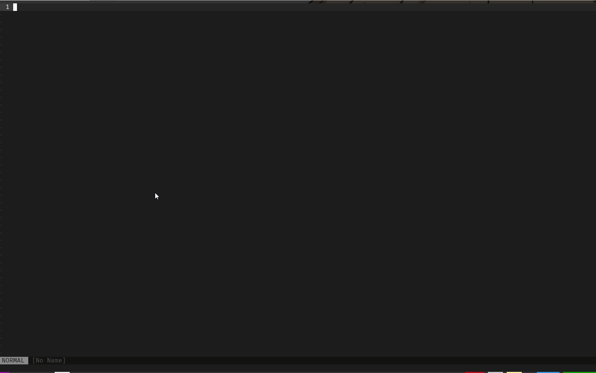

# vimプラグインを作った。
1月ももう終わりだ。   
本当に早い。    
今は案件で忙しいため中々ブログが更新できないが少しずつ更新できればいいなと思っている。   
vimプラグインを作った。タイムスタンプがメモ帳の名前になるvimプラグインでメモを取りたいときにすぐメモを取ることができる。    
また今まで取ったメモもリスト化して見返すことができるのでまぁまぁの完成度のものができた。   

これか完成したvimプラグインだ。   


相変わらず中身がないものを作ってしまったが、これから説明をつけ足したり色々で来たらいいなと思っている。   
業務に導入してみて修正したところが早速出てきたので徐々に修正するつもりだ。   

## 苦労した点
VimScriptが優秀なのかあまり戸惑うことがなく実装できた。   
一つ上げるとすれば引数の変数を使う際はa:を変数の前につけるのだが、それを知らなくて1時間近く関数が動かないことで悩んでいた。   

何とかそれに気づいて作ったtimestampMemo#edit_memo関数
```vim
" メモファイル編集処理
function! timestampMemo#edit_memo(file) abort
    " メモファイルを開く
    execute "tabedit " . join([g:timestamp_save_path, a:file], s:sep)
endfunction
```

## 修正点
1. そんな頻繁にメモを取らないyyyymmddだけで命名は良かった。
2. 削除機能を追加する。
3. 名前を変更できるようにする。
4. ---- yyyy/mm/ddみたいないつとったメモかわかるようなマークをいれたい

## 所感
今回、0からvimプラグインを作成してみてとても勉強になったのと自分が頭の中で考えたものが形になるのはとてもいいなと感じた。   
これからもvimプラグインを作っていきたいと思う。

