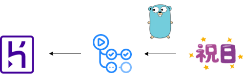

# HerokuとGitHub ActionsとGoを使って祝日APIを作った話

※zennやはてなブログに記事を上げるための下書き見たいなもの

## APIをつくろう
Goを学んでいてせっかくならなにか作ろうと思い、社内のチャットで祝日APIについて話がされていたので、
この機会に祝日APIをGoで作成しました。

今回作る祝日APIPのデータは内閣府の[国民の祝日について](https://www8.cao.go.jp/chosei/shukujitsu/gaiyou.html)というサイトのCSVから2021～2023年までのデータを使って作成しています。
「2021」や「2022」と年を入力して検索すると入力された年の祝日一覧がJSON形式で見れるようにしています。

## システム構成


極力お金をかけずかつDBを使わず、運用にも手間がかからないようにしたかったので
- 祝日のデータはGoで構造体として持たせて、処理でJson形式に変換する。
- GitHub Actionsを使ってBuild/Test/Lintの工程を自動で実施してもらって、ある程度の品質を担保する。
- GitHubのmasterリポジトリにマージしたら、自動でHerokuリポジトリにデプロイされるようにして即時公開できるようにする。

という形にしてみました。

今のところ公開したばかりなので問題は出てないですが、データの数や扱うパラメータが増えたらシステム構成からまた見直そうかなと考えています。

## ## 完成したもの
以下今回の成果物になります。   
https://github.com/jacoloves/go-sample-holiday-api

リクエストは2パターンありまして、
- `https://go-holiday-api.herokuapp.com/holiday`もしくは`https://go-holiday-api.herokuapp.com/holiday/`のどちらかをリクエストすると2021～2023年のすべての祝日のデータを取得する子ができます。
- `https://go-holiday-api.herokuapp.com/holiday/year/yyyy`をリクエストすることで「yyyy」年の祝日を取得することができます。

上記の2つがあります。

### 使用例
```curl
curl -s https://go-holiday-api.herokuapp.com/holiday/year/2022
```

レスポンスは以下の通りです。

```json
[
  {
   "Title": "元旦",
   "Date": "2022-01-01"
  },
  {
   "Title": "成人の日",
   "Date": "2022-01-10"
  },
  {
   "Title": "建国記念の日",
   "Date": "2022-02-11"
  },
  {
   "Title": "天皇誕生日",
   "Date": "2022-02-23"
  },
  {
   "Title": "春分の日",
   "Date": "2022-03-21"
  },
  {
   "Title": "昭和の日",
   "Date": "2022-04-29"
  },
  {
   "Title": "憲法記念日",
   "Date": "2022-05-03"
  },
  {
   "Title": "みどりの日",
   "Date": "2022-05-04"
  },
]
```

カレンダーデータは以下の構造になります。   
| 名前 | 型 | 説明 | 例 |
| ---- | ---- | ---- | ---- |
| Title | string | 祝日の名称 | "元旦" |
| Date | string | 日付を**YYY-MM-DD**形式で表したもの | "2022-01-01" |

以下今回作ったもの成果物になります。   
https://github.com/jacoloves/go-sample-holiday-api

## プログラム
今回はGoで構造体を作ってそれをJsonに変換する方法でAPIを作成しました。
jsonライブラリのMarshallIndentが綺麗にデータを整形してくるので便利でした。
https://pkg.go.dev/encoding/json#MarshalIndent

### sever.go
後述する祝日が構造体で書かれているGoファイルを読み込んで、dateHandlerという構造体に順々に格納しています。   
そのあと取得できたリクエストにより出力の方法を変更しています。   

```go
package main

import (
	"encoding/json"
	"log"
	"net/http"
	"os"
	"regexp"
	"sync"
)

var (
	listHolidayRe = regexp.MustCompile(`^\/holiday[\/]*$`)
	getHolidayRe  = regexp.MustCompile(`^\/holiday\/year\/(\d+)$`)
)

type Data []struct {
	Title string `json:"Title"`
	Date  string `json:"Date"`
}

type datastore struct {
	m map[string]Data
	*sync.RWMutex
}

type dateHandler struct {
	store *datastore
}

func (h *dateHandler) ServeHTTP(w http.ResponseWriter, r *http.Request) {
	switch {
	case r.Method == http.MethodGet && listHolidayRe.MatchString(r.URL.Path):
		h.List(w, r)
		return
	case r.Method == http.MethodGet && getHolidayRe.MatchString(r.URL.Path):
		h.Get(w, r)
		return
	default:
		notFound(w, r)
		return
	}
}

func (h *dateHandler) List(w http.ResponseWriter, r *http.Request) {
	h.store.RLock()
	holiday := make([]Data, 0, len(h.store.m))
	for _, v := range h.store.m {
		holiday = append(holiday, v)
	}
	h.store.RUnlock()
	jsonBytes, err := json.MarshalIndent(holiday, " ", " ")
	if err != nil {
		internalServerError(w, r)
		return
	}
	w.WriteHeader(http.StatusOK)
	_, err = w.Write(jsonBytes)
	if err != nil {
		log.Fatal(err)
		return
	}
}

func (h *dateHandler) Get(w http.ResponseWriter, r *http.Request) {
	matches := getHolidayRe.FindStringSubmatch(r.URL.Path)
	if len(matches) < 2 {
		notFound(w, r)
		return
	}
	h.store.RLock()
	y, ok := h.store.m[matches[1]]
	if !ok {
		w.WriteHeader(http.StatusNotFound)
		_, err := w.Write([]byte("year not found"))
		if err != nil {
			log.Fatal(err)
			return
		}
	}
	jsonBytes, err := json.MarshalIndent(y, " ", " ")
	if err != nil {
		internalServerError(w, r)
		return
	}
	w.WriteHeader(http.StatusOK)
	_, err = w.Write(jsonBytes)
	if err != nil {
		log.Fatal(err)
		return
	}
}

func internalServerError(w http.ResponseWriter, r *http.Request) {
	w.WriteHeader(http.StatusInternalServerError)
	_, err := w.Write([]byte("internal server error"))
	if err != nil {
		log.Fatal(err)
	}
}

func notFound(w http.ResponseWriter, r *http.Request) {
	w.WriteHeader(http.StatusNotFound)
	_, err := w.Write([]byte("not found"))
	if err != nil {
		log.Fatal(err)
	}
}

func main() {
	port := os.Getenv("PORT")
	h1 := holiday_2021()
	h2 := holiday_2022()
	h3 := holiday_2023()

	mux := http.NewServeMux()
	dHandler := &dateHandler{
		store: &datastore{
			m: map[string]Data{
				"2021": Data(h1),
				"2022": Data(h2),
				"2023": Data(h3),
			},
			RWMutex: &sync.RWMutex{},
		},
	}

	mux.Handle("/holiday", dHandler)
	mux.Handle("/holiday/", dHandler)

	if err := http.ListenAndServe(":"+port, mux); err != nil {
		log.Fatal(err)
	}
}
```

### holiday_YYYY.go
各年の祝日を構造体で格納してあるファイルです。   
今回は2021、2022、2023の3つのファイルを用意しました。

```go
package main

type Data_2021 []struct {
	Title string `json:"Title"`
	Date  string `json:"Date"`
}

func holiday_2021() Data_2021 {
	holidays_2021 := Data_2021{
		{
			Title: "元旦",
			Date:  "2021-01-01",
		},
		{
			Title: "成人の日",
			Date:  "2021-01-11",
		},
		{
			Title: "建国記念の日",
			Date:  "2021-02-11",
		},
		{
			Title: "天皇誕生日",
			Date:  "2021-02-23",
		},
		{
			Title: "春分の日",
			Date:  "2021-03-20",
		},
		{
			Title: "昭和の日",
			Date:  "2021-04-29",
		},
		{
			Title: "憲法記念日",
			Date:  "2021-05-03",
		},
		{
			Title: "みどりの日",
			Date:  "2021-05-04",
		},
		{
			Title: "こどもの日",
			Date:  "2021-05-05",
		},
		{
			Title: "海の日",
			Date:  "2021-07-22",
		},
		{
			Title: "スポーツの日",
			Date:  "2021-07-23",
		},
		{
			Title: "山の日",
			Date:  "2021-08-08",
		},
		{
			Title: "休日",
			Date:  "2021-08-09",
		},
		{
			Title: "敬老の日",
			Date:  "2021-09-20",
		},
		{
			Title: "秋分の日",
			Date:  "2021-09-23",
		},
		{
			Title: "文化の日",
			Date:  "2021-11-03",
		},
		{
			Title: "勤労感謝の日",
			Date:  "2021-11-23",
		},
	}

	return holidays_2021
}
```

## Test
### sever_test.go
今回は一般に公開することもあり、はじめてGoでテストを書きました。   
Httpのステータスコードの確認しか行っていませんが、将来的にはデータの確認もしていきたいと思います。   
（あともっと綺麗な書き方があったと思うので今後改善していきたいです。）   
```go
package main

import (
	"fmt"
	"net/http"
	"net/http/httptest"
	"sync"
	"testing"
)

func TestMain(t *testing.T) {

	h1 := holiday_2021()
	h2 := holiday_2022()
	h3 := holiday_2023()

	dHandler := &dateHandler{
		store: &datastore{
			m: map[string]Data{
				"2021": Data(h1),
				"2022": Data(h2),
				"2023": Data(h3),
			},
			RWMutex: &sync.RWMutex{},
		},
	}
	ts := httptest.NewServer(http.Handler(dHandler))
	defer ts.Close()
	// /holiday pass Test
	resp, err := http.Get(fmt.Sprintf("%s/holiday", ts.URL))
	if err != nil {
		t.Fatalf("Excepted no error, got %v", err)
	}
	defer resp.Body.Close()

	if resp.StatusCode != http.StatusOK {
		t.Fatalf("Expected status code 200, got %v", resp.StatusCode)
	}

	// /holiday/ pass Test
	resp2, err := http.Get(fmt.Sprintf("%s/holiday/", ts.URL))
	if err != nil {
		t.Fatalf("Excepted no error, got %v", err)
	}
	defer resp2.Body.Close()

	if resp2.StatusCode != http.StatusOK {
		t.Fatalf("Expected status code 200, got %v", resp2.StatusCode)
	}

	// /holiday/year/2022 pass Test
	resp3, err := http.Get(fmt.Sprintf("%s/holiday/year/2022", ts.URL))
	if err != nil {
		t.Fatalf("Excepted no error, got %v", err)
	}
	defer resp3.Body.Close()

	if resp3.StatusCode != http.StatusOK {
		t.Fatalf("Expected status code 200, got %v", resp3.StatusCode)
	}

	// /holiday/year/2021 pass Test
	resp4, err := http.Get(fmt.Sprintf("%s/holiday/year/2021", ts.URL))
	if err != nil {
		t.Fatalf("Excepted no error, got %v", err)
	}
	defer resp4.Body.Close()

	if resp4.StatusCode != http.StatusOK {
		t.Fatalf("Expected status code 200, got %v", resp4.StatusCode)
	}

	// /holiday/year/2023 pass Test
	resp5, err := http.Get(fmt.Sprintf("%s/holiday/year/2023", ts.URL))
	if err != nil {
		t.Fatalf("Excepted no error, got %v", err)
	}
	defer resp5.Body.Close()

	if resp5.StatusCode != http.StatusOK {
		t.Fatalf("Expected status code 200, got %v", resp5.StatusCode)
	}

	// /holiday/year/2020 not pass Test
	resp6, err := http.Get(fmt.Sprintf("%s/holiday/year/2020", ts.URL))
	if err != nil {
		t.Fatalf("Excepted no error, got %v", err)
	}
	defer resp6.Body.Close()

	if resp6.StatusCode != http.StatusNotFound {
		t.Fatalf("Expected status code 404, got %v", resp6.StatusCode)
	}

	// /holiday/year/2024 not pass Test
	resp7, err := http.Get(fmt.Sprintf("%s/holiday/year/2024", ts.URL))
	if err != nil {
		t.Fatalf("Excepted no error, got %v", err)
	}
	defer resp7.Body.Close()

	if resp7.StatusCode != http.StatusNotFound {
		t.Fatalf("Expected status code 404, got %v", resp7.StatusCode)
	}
}
```

## GiHub Actions
こちらも初めてGitHub Actionsを使ってみたのですが、とても便利でした。      
ymlの書き方がわからなかったのですが、テンプレートを子会してくださっている方がいたのでそれをコピペしてちょっと直せば動きました。   
[テンプレート元](https://qiita.com/takehanKosuke/items/4c5f5a28825eb460ae7f)

また初回はGitHubにpushできない事象が発生しましたが、設定でworkflowをチェック入れることで解消しました。
https://zenn.dev/urasaku77/articles/dd94110dd1041a

### go-sample-holiday-api.yml

```yml
name: Go

on:
  push:
    branches: [ master ]
  pull_request:
    branches: [ master ]

jobs:
  # setup
  setup:
    runs-on: ubuntu-latest
    steps:
      - name: set up
        uses: actions/setup-go@v2
        with:
          go-version: 1.17
        id: go
      - name: check out
        uses: actions/checkout@v2

      - name: Cache
        uses: actions/cache@v2.1.0
        with:
          path: ~/go/pkg/mod
          key: ${{ runner.os }}-go-${{ hashFiles('**/go.sum') }}
          restore-keys: |
            ${{ runner.os }}-go-

  # build
  build:
    needs: setup
    runs-on: ubuntu-latest
    steps:
      - uses: actions/checkout@v2
      - name: build
        run: go build ./...

  # test
  test:
    needs: setup
    runs-on: ubuntu-latest
    steps:
      - uses: actions/checkout@v2
      - name: test
        run: go test ./... -v

  # lint
  lint:
    needs: setup
    runs-on: ubuntu-latest
    steps:
      - uses: actions/checkout@v2
      - name: golangci-lint
        uses: golangci/golangci-lint-action@v2
        with:
          version: v1.29
```

## 振り返り
今回初めてGitHub Actionsを使ったのですが便利です！    
Build/Test/Lintを自動でやってくれて品質をある程度担保できるので、リリースするまでの心理的なハードルがだいぶ下がります！   
今後もなにか作る際は採用していきたいと思います。   
久しぶりにHerokuを採用しましたが、簡単なアプリケーションをデプロイする際はとても便利なので、AWSや他Iaasを使うほどでもないものには使っていきたいです。 
