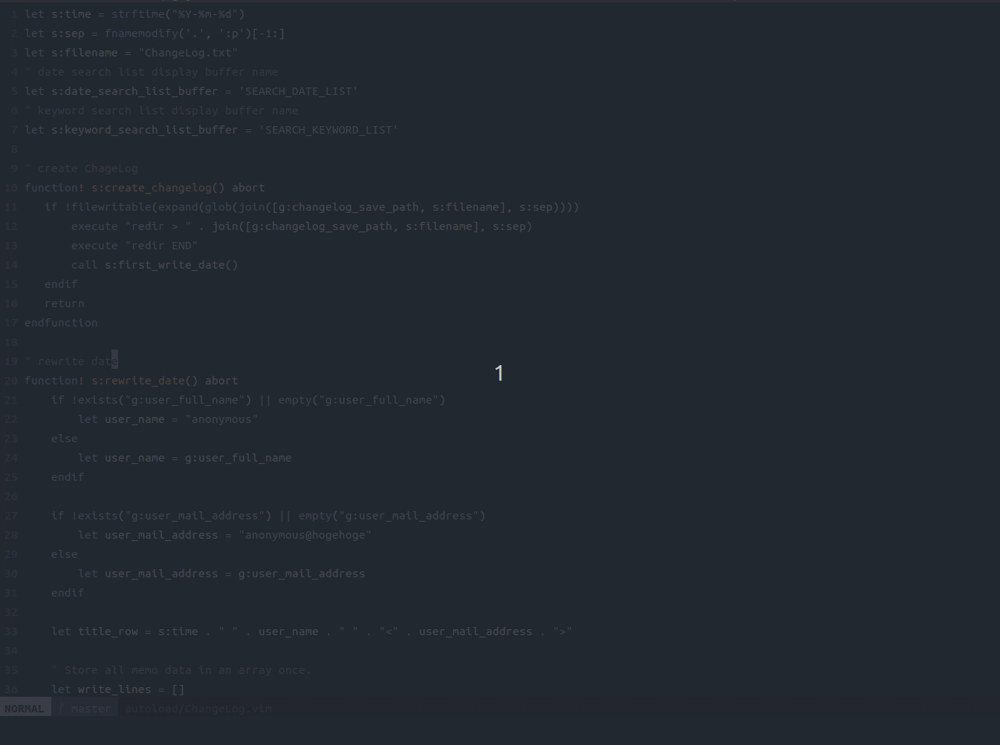
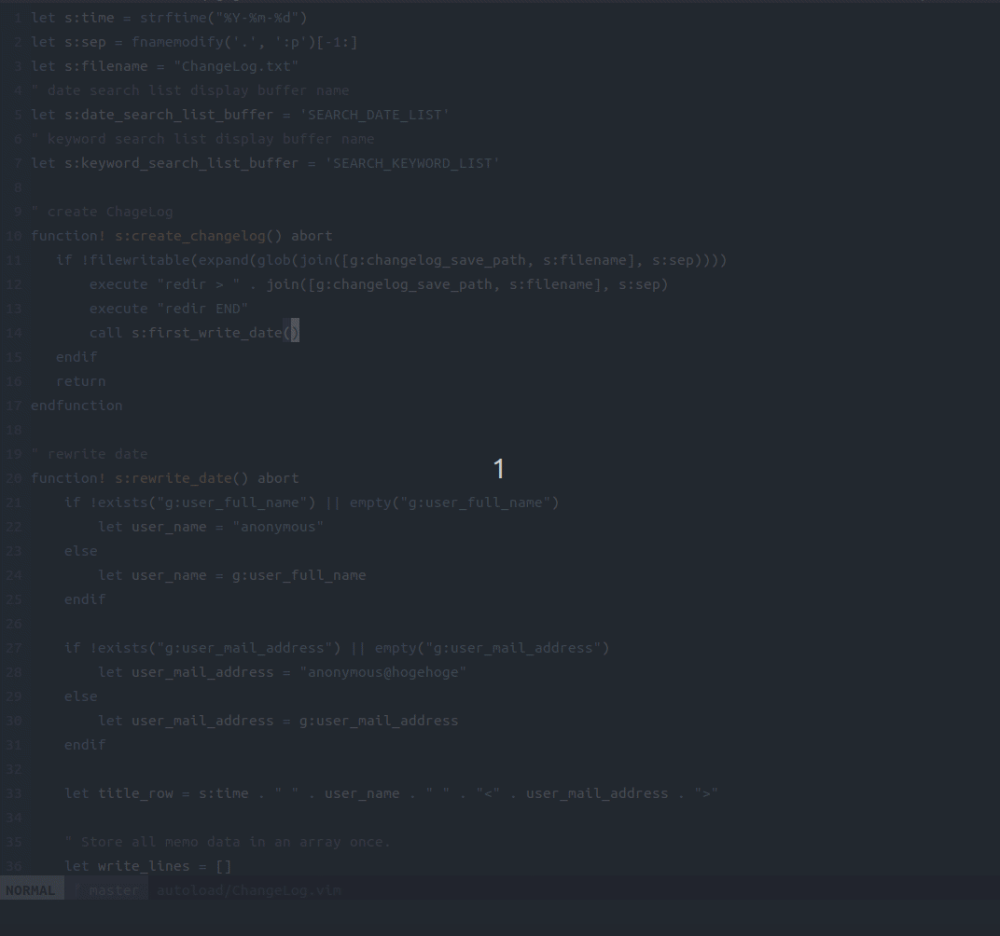
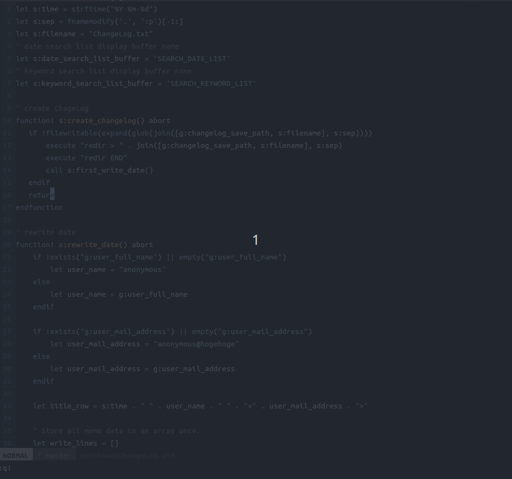

# 下書き　社内ブログに書くのでVimプラグインを作ったときの下書き

# GW中にVimプラグインを作った
http://0xcc.net/unimag/1/ から影響を受けたメモツールを作成しました。   
日々のメモや開発メモなどに活用してみてください！   
https://github.com/jacoloves/vim-ChangeLog

# 動作概要 
・Vimで動作します！（NeoVimでの動作は確認中です。）   
・以下の機能を作成しました。

1. 新しいChangelog.txtファイルを作成します。   
2. Changelog.txtが作成されている場合、現在時刻と名前とメールアドレスを先頭の行に挿入します。
3. メモを書いた日付を検索します。
4. キーワードを検索します。（文頭に\*が記載されてるものだけです）

# 使い方
## ChangeLogOpen
新しいChangelog.txtファイルを作成します。   
Changelog.txtが作成されている場合、現在時刻と名前とメールアドレスを先頭の行に挿入します。

この処理は初めに *create_changelog()* で *Changelog.txt* の存在を確認してなければ作成する処理になります。   
・create_changelog()のソースコード   
```vim
function! s:create_changelog() abort
   if !filewritable(expand(glob(join([g:changelog_save_path, s:filename], s:sep))))
       execute "redir > " . join([g:changelog_save_path, s:filename], s:sep)
       execute "redir END"
       call s:first_write_date()
   endif
   return
endfunction
```
その後 *check_date()* で現在日付が存在するか確認し、存在しない場合は新規記載し、存在する場合はそのまま*Changelog.txt*を開きます。   
存在しない場合の新規記載はfirst_write_date()で処理します。   
結合した日付ファイルに下記出しています。   
・first_write_date()のソースコード   
```vim
function! s:first_write_date() abort
    if !exists("g:user_full_name") || empty("g:user_full_name")
        let user_name = "anonymous"
    else
        let user_name = g:user_full_name
    endif

    if !exists("g:user_mail_address") || empty("g:user_mail_address")
        let user_mail_address = "anonymous@hogehoge"
    else
        let user_mail_address = g:user_mail_address
    endif

    let title_row = s:time . " " . user_name . " " . "<" . user_mail_address . ">"

    let lines = [title_row, "\t"] 

    call writefile(lines, expand(join([g:changelog_save_path, s:filename], s:sep)))

    return
endfunction
```

ファイルが作成されていてその続きにメモを記載する場合は、rewrite_date()で現在日付を文頭に挿入します。    
first_write_date()と処理が似ていますが、一度配列にメモファイルの中身を取り出してその配列の先頭に新規日付を挿入しています。   
・rewrite_date()の一部   
```vim
" Store all memo data in an array once. 
let write_lines = []
for line in readfile(expand(join([g:changelog_save_path, s:filename], s:sep)))
    call add(write_lines, line)
endfor

" Insert the date in the first row of the array and the tab in the second
" row.
call insert(write_lines, title_row, 0)
call insert(write_lines, "\t", 1)
```

## SearchDatechangeLog
メモを記載した日付を検索します。エンターキーを押すと目的の日付の行にジャンプします。   
qを押すとバッファが閉じます。

*ChangeLog#searchDate()* でメモから抽出した日付をバッファに表示します。   
日付を選択すると *ChangeLog#jump_date_row()* を呼び出して対象の行にシャンプします。   

## SearchKeywordChangeLog
キーワードを検索します。（文頭に\*が記載されてるものだけです）   
エンターキーを押すと目的のキーワードの行にジャンプします。   
qを押すとバッファが閉じます。   

*ChangeLog#searchKeyword()* でメモから抽出したキーワードを表示します。
キーワードを選択すると *ChangeLog#jump_keyword_row()* を呼び出して対象の行にジャンプします。   

# 所感
Vimのバッファを利用することで便利なメモツールを作成することができました。   
今回作成して学んだことを通してまた新しいVimプラグインを作成していきたいです。   
