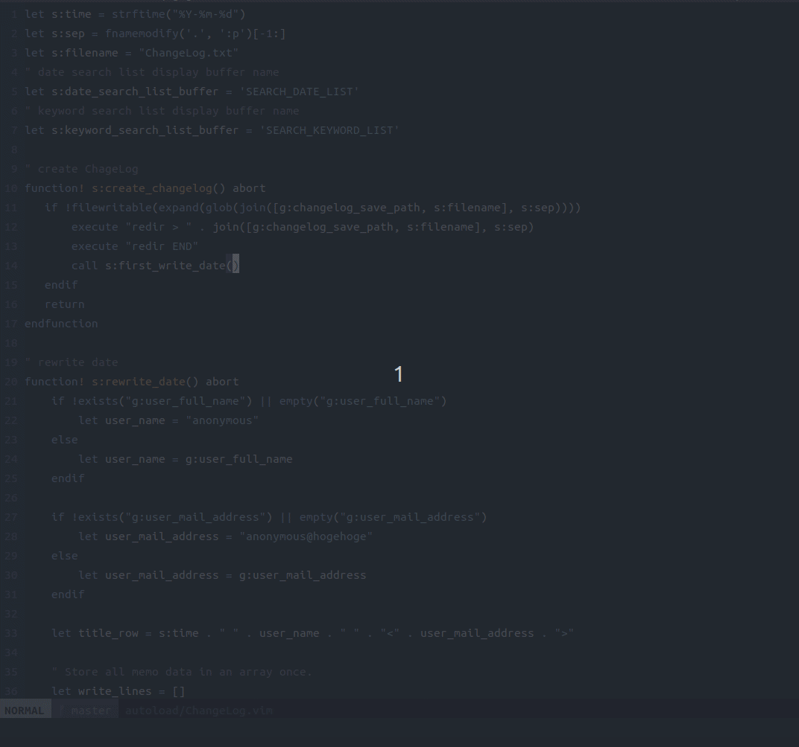

# 下書き　社内ブログに書くのでVimプラグインを作ったときの下書き

# GW中にVimプラグインを作った
http://0xcc.net/unimag/1/ から影響を受けたメモツールを作成しました。   
日々のメモや開発メモなどに活用してみてください！   
https://github.com/jacoloves/vim-ChangeLog

# 動作概要 
・Vimで動作します！（NeoVimでの動作は確認中です。）   
・以下の機能を作成しました。

1. 新しいChangelog.txtファイルを作成します。   
2. Changelog.txtが作成されている場合、現在時刻と名前とメールアドレスを先頭の行に挿入します。
3. メモを書いた日付を検索します。
4. キーワードを検索します。（文頭に\*が記載されてるものだけです）

# 使い方
## ChangeLogOpen
新しいChangelog.txtファイルを作成します。   
Changelog.txtが作成されている場合、現在時刻と名前とメールアドレスを先頭の行に挿入します。

この処理は初めに *create_changelog()* で *Changelog.txt* の存在を確認してなければ作成する処理になります。   
その後 *check_date()* で現在日付が存在するか確認し、存在しない場合は新規記載し、存在する場合はそのまま*Changelog.txt*を開きます。   

## SearchDatechangeLog
メモを記載した日付を検索します。エンターキーを押すと目的の日付の行にジャンプします。   
qを押すとバッファが閉じます。

*ChangeLog#searchDate()* でメモから抽出した日付をバッファに表示します。   
日付を選択すると *ChangeLog#jump_date_row()* を呼び出して対象の行にシャンプします。   

## SearchKeywordChangeLog
キーワードを検索します。（文頭に\*が記載されてるものだけです）   
エンターキーを押すと目的のキーワードの行にジャンプします。   
qを押すとバッファが閉じます。   

*ChangeLog#searchKeyword()* でメモから抽出したキーワードを表示します。
キーワードを選択すると *ChangeLog#jump_keyword_row()* を呼び出して対象の行にジャンプします。   

# 所感
Vimのバッファを利用することで便利なメモツールを作成することができました。   
今回作成して学んだことを通してまた新しいVimプラグインを作成していきたいです。   
