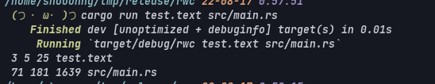

# Rustで簡易的なLinuxコマンドのwcを作る

1. 今回作るwcコマンドについて
2. Rustで作成してみる
3. 苦労した点、大変だった点
4. 最後に

こんにちは。たなしょです。   
Rustを勉強していてついでに何か作成してみようと思い、   
割と簡単に実装できそうな[wcコマンド](https://linuxjm.osdn.jp/html/gnumaniak/man1/wc.1.html)を作成してみようと思います。   

## 今回作るwcコマンドについて
作成するwcコマンドはLinuxに標準についているwcコマンドを機能を抜粋したものを作成します。   
今回作成するコマンドの基本性能は下記になります。   
・引数に指定したファイルの行数、単語数、バイト数、ファイル名を出力する。   
・ファイルが一つも与えられない時は標準入力から読み込む。   

上記二つの機能を実装した「なんちゃってwcコマンド」を作成します。   

## Rustで作成してみる
Rustで「なんちゃってwcコマンド」を実装してみました。
以下がソースコードになります。

https://github.com/jacoloves/rwc

各関数を軽く説明していくと、

main()はコマンドライン引数を読み込んで、引数が2つ未満ならdo_stdout()（標準入力を読み込み、標準出力に返す関数）を実行します。   
引数が2つ以上の場合はdo_wcl()（ファイルを読み込んで、 行数を取得する関数）とdo_wcw()（ファイルを読み込んで、 単語数を取得する関数）とdo_wcb()（ファイルのバイト数を取得する）の三つの関数を実行します。   

do_wcb()関数には[fsライブラリのMetadata構造体](https://doc.rust-lang.org/std/fs/struct.Metadata.html)を使用してファイルのバイト数を取得しています。

以下が実行結果になります。   
出力の成形ができていませんが指定したファイルの行数、単語数、バイト数、ファイル名を出力できています。   

## 苦労した、大変だった点
今回はファイルのバイト数の取得に苦労しました。   
当初は[libcクレート](https://crates.io/crates/libc)の[open](https://docs.rs/libc/0.2.71/libc/fn.open.html)と[read](https://docs.rs/libc/0.2.29/libc/fn.read.html)を使用すれば実現できるかと思い実装してみましたが思うように実装できなかったので色々と調べてみたところ、前述した[fsライブラリのMetadata構造体](https://doc.rust-lang.org/std/fs/struct.Metadata.html)を使用することでバイト数を取得することにしました。   

## 最後に
今後は出力結果を成形したり、オプションを使えるようにしようかと考えています。    

最後までお読みいただきありがとうございました。